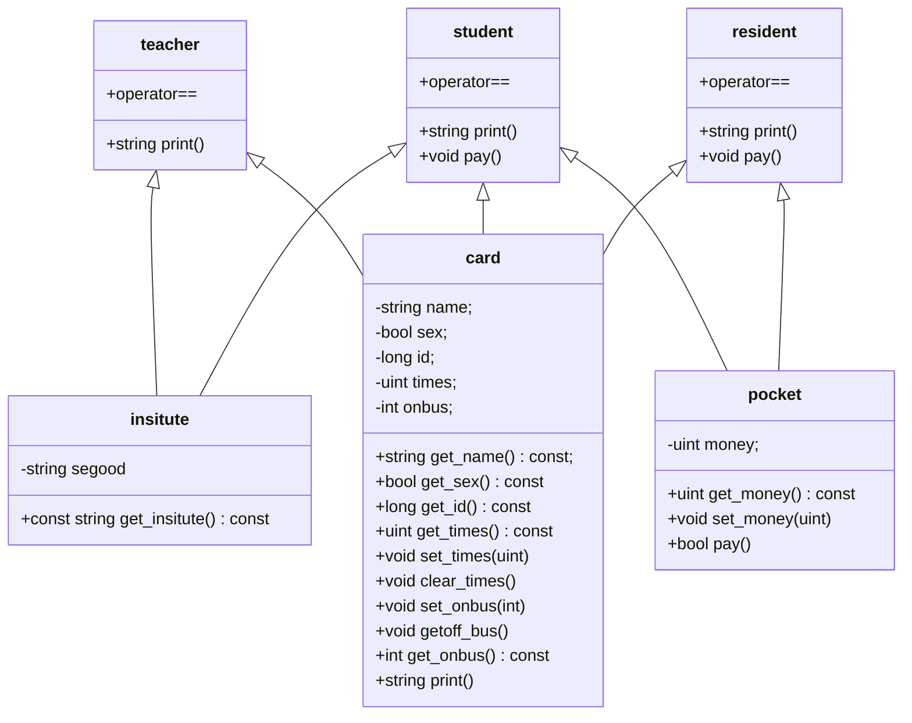

# 大作业：一卡通模拟系统
说是一卡通，实际上就是公交卡。所以我们可以称之为：  
	College ID Card and College Bus Simulation Program

## 程序构成

### maggie.hpp
我觉得我们的程序是必须要做到独立自主，要在复杂多变的电脑环境中保持自己的独立性。所以，我使用了 C++ 里面命名空间的知识，专门为这个程序规定了 maggie 命名空间。  
这个命名空间里面引用了 std 命名空间，为了从 C++ 优秀的通用库中取其精华，弃其糟粕。另外，我还规定了一些公用的变量，体现出程序的灵活性。  
(这是什么奇怪的政治新闻语言)

### card.hpp
先分析一下哈，我们要为老师，学生，居民设计一卡通。除了共有信息，老师坐车不用花钱，居民有二十次免费乘车，而且不隶属于学院。好，学生这是第几次受伤了捏:-P  
这里，我先实现了三个基本类：校园卡基本信息 `card` ，学院信息 `insitute`，还有卡里的钱包 `pocket` 。基于这三个类，我们可以实现老师 `teacher` ，学生 `student` 和居民 `resident` 了。这三个类是继承了 `card` 类，然后按需引用了 `insitute` 或/和 `pocket` 类了。  
代码太多了，Typora 支持 mermaid 画画工具，请看由他带来的图解。  
注意，`card` 里面有个 `print()` 纯虚函数，`pocket` 里面有个 `pay()` 纯虚函数。



### card_process.hpp
注意：因为仅仅是为了方便使用，我直接让其全部共有。  
这里我建立了三个表，分别存了老师卡，学生卡和家属卡的信息。  
然后是几个函数，分别是新建一张一卡通，管理这些一卡通，存储一卡通和打印一卡通信息。  
管理功能包括充值、查询余额、询已使用次数、注销卡。  
存储的信息是纯文本信息，每个类里面的 `print()` 函数是用来输出存储的信息的。

```C++
struct card_process
{
    vector<teacher> teachers;
    vector<student> students;
    vector<resident> residents;
    void add_cards();
    void card_management();
    void read_cardlist();
    void save_cardlist();
    void print_cardlist();
};
```

### bus.hpp
这个是公交车类，里面存了驾驶人信息，车辆型号，车辆编号，发车时间，上车人数，上车人员。  
关于公交车型号，由于本题目只有两个：大车五十人，小车三十人。我就直接使用了布尔型，为真是五十人，为假是三十人。

```C++
class bus
{
private:
    string driver;      
    uint id; 
    bool model;
    uint onboard_id;
    uint offtime;
    uint onboard_count;

public:
	uint get_max() const { return model ? 50 : 30; }
	// Lots of functions, omit them here.
	...
}
```
还有上车人员，是**一个**整型常量，存的卡号。这里先剧透一些关于模拟运行的信息。发车时电脑会随便输入个乘员人数，然后随便从一卡通名单里面摇一个人上车，只有一个人被摇中嘛。

### bus_process.hpp
注意：因为仅仅是为了方便使用，我直接让其全部共有。  
首先是两个表，一个是正在运行的车，一个是在车站没出发的车。毕竟模拟嘛，这点仪式感还是得有的;-)  
然后是读写公交车信息，添加公交车，列出所有公交车。(感觉永远就是这几套)  
读写公交车过程可类比一卡通信息的读写过程。

```C++
struct bus_process
{
    vector<bus> station;
    vector<bus> ongoing;
    void add_bus();
    void list_bus(vector<bus> &);
    void bus_management();
    void read_station();
    void save_station();
};
```

## 运行流程

### 先说一句
如何管理一卡通和公交车信息的过程，我上面应该说得明白了，这里就不说了。实在不行看源代码吧。  
顺便说一下  C++ 11 循环，现在我们可以使用 `for (auto &i : <vector_of_something>)`来循环了。什么类型迭代器啥的给老子去死吧，auto 一写，让编译器自己猜去吧。而且三个分号的复杂也没了。  
(这就是菜鸡小白第一次知道这玩意时候的山口山)

### 运行模拟方式
先说一句，这段代码在 main.cpp 里面。
1. 先遍历一遍所有公交车，给所有的车辆随便编个发车时间。
2. 在发车时间内，分别循环遍历所有在车站的车和在运行的车辆。如果到时间了发车了，就将其从车站数组里面移到运行中车的数组。如果运行时间到了，就将其从运行中车的数组里面移回车站数组。
3. 发车的时候，首先随便编个车辆有多少人。然后很不走心地从一卡通名单里面摇一个人最尊贵的乘客上车。上车的时候，车辆有空座，上车的人没有坐在另一辆车上，而且能支付得起车票钱。如果三类人都没摇上人，就没摇上吧。
4. 回到车站的时候，把人清空，再把最尊贵的乘客请下车。

### 如何更加省心地随便编个数
1. 先引入 C++ 11 标准的全新标准库 `random`。
2. 先找个能生成随机种子的随机数引擎，我用的是 `random_device`，在 Linux 上相当于读取 `/dev/urandom` 产生的随机数。我们不使用该引擎生成随机数，因为根据原理，在生成随机数的时候，会产生大量的输入输出中断，一定程度上影响性能，而且会下降 `/dev/urandom` 生成随机数的质量。
3. 然后利用上述引擎，生成我们要用的引擎 `default_random_engine`。
4. 我们利用该随机数引擎，生成随机数。由于我们这里使用无符号的随机数，遵循均匀分布，我们使用 `uniform_int_distribution<uint>` 类来生成之。
顺便说一句，`random`库还能支持你在概率论课程上学到的所有玩意，比如万恶的正态分布，泊松分布啥的。

## 运行片断

###  一卡通管理
```bash
[superbart@superbart-laptop exp4]$ ./out 
Reading cardlist...
Reading bus...
1.管理班车
2.管理卡
3.运行模拟
0.退出
2
选1办理新卡，选2充值业务，选3查询余额，选4查询已使用次数，选5注销卡，选6列出所有卡片，选0退出
6
Teachers
name            sex     id      times   insitute
Reality         1       10010   2       Marx
History         0       10011   1       Marx
Patchouli               0       10012   0       Software
Students
name            sex     id      money   times   insitute
Maurice         1       2100101 46      2       Electronic
Barry           1       2100102 60      0       Computer
Robin           0       2000103 70      0       Computer
Tony            1       2000104 80      0       Computer
Rutherford              0       2000106 90      0       Software
Phil            0       2000107 100     0       Software
Gaburil         1       2000108 110     0       Security
Hackett         0       2000109 118     1       Communication
Residents
name            sex     id      money   times
Clapton         0       1654788908      50      2
Baker           0       1654789794      30      2
```
### 班车模拟
```bash
1.管理班车
2.管理卡
3.运行模拟
0.退出
1
1. 新建班车
2. 查看班车
0. 退出
2
Maggie  1       0
Bender  6       1
Homer   3       1
Marge   4       0
Bart    2       1
Lisa    5       0
```
### 运行模拟
```bash
[superbart@superbart-laptop exp4]$ ./out 
Reading cardlist...
Reading bus...
1.管理班车
2.管理卡
3.运行模拟
0.退出
3
====模拟开始====
Maggie的班车离站时间设定为10点
Bender的班车离站时间设定为11点
Homer的班车离站时间设定为16点
Marge的班车离站时间设定为9点
Bart的班车离站时间设定为14点
Lisa的班车离站时间设定为10点

现在开始模拟
目前时间是6点
进站侦测，一共有0辆车
离站侦测
5.Evaling Lisa
4.Evaling Bart
3.Evaling Marge
2.Evaling Homer
1.Evaling Bender
0.Evaling Maggie
正在车站的车有6辆：
Maggie  1       0
Bender  6       1
Homer   3       1
Marge   4       0
Bart    2       1
Lisa    5       0
正在运行的车有0辆：

目前时间是7点
进站侦测，一共有0辆车
离站侦测
5.Evaling Lisa
4.Evaling Bart
3.Evaling Marge
2.Evaling Homer
1.Evaling Bender
0.Evaling Maggie
正在车站的车有6辆：
Maggie  1       0
Bender  6       1
Homer   3       1
Marge   4       0
Bart    2       1
Lisa    5       0
正在运行的车有0辆：

目前时间是8点
进站侦测，一共有0辆车
离站侦测
5.Evaling Lisa
4.Evaling Bart
3.Evaling Marge
2.Evaling Homer
1.Evaling Bender
0.Evaling Maggie
正在车站的车有6辆：
Maggie  1       0
Bender  6       1
Homer   3       1
Marge   4       0
Bart    2       1
Lisa    5       0
正在运行的车有0辆：

目前时间是9点
进站侦测，一共有0辆车
离站侦测
5.Evaling Lisa
4.Evaling Bart
3.Evaling Marge
Marge的班车要离站
车上了5人，摇人。
本次免费乘坐，还剩下18次。
班车4上了家属，其名字为Baker
2.Evaling Homer
1.Evaling Bender
0.Evaling Maggie
正在车站的车有5辆：
Maggie  1       0
Bender  6       1
Homer   3       1
Bart    2       1
Lisa    5       0
正在运行的车有1辆：
Marge   4       0

目前时间是10点
进站侦测，一共有1辆车
0.Evaling Marge
Marge的班车要到站
Looking for the next...
离站侦测
5.Evaling Marge
4.Evaling Lisa
Lisa的班车要离站
车上了18人，摇人。
本次免费乘坐，还剩下18次。
班车5上了家属，其名字为Clapton
3.Evaling Bart
2.Evaling Homer
1.Evaling Bender
0.Evaling Maggie
Maggie的班车要离站
车上了18人，摇人。
我不想抽了，如果我的人生只有 Maggie 那该多好啊。
正在车站的车有4辆：
Bender  6       1
Homer   3       1
Bart    2       1
Marge   4       0
正在运行的车有2辆：
Lisa    5       0
Maggie  1       0

目前时间是11点
进站侦测，一共有2辆车
1.Evaling Maggie
Maggie的班车要到站
Looking for the next...
0.Evaling Lisa
Lisa的班车要到站
Looking for the next...
离站侦测
5.Evaling Lisa
4.Evaling Maggie
3.Evaling Marge
2.Evaling Bart
1.Evaling Homer
0.Evaling Bender
Bender的班车要离站
车上了40人，摇人。
班车6上了History老师
正在车站的车有5辆：
Homer   3       1
Bart    2       1
Marge   4       0
Maggie  1       0
Lisa    5       0
正在运行的车有1辆：
Bender  6       1

目前时间是12点
进站侦测，一共有1辆车
0.Evaling Bender
Bender的班车要到站
Looking for the next...
离站侦测
5.Evaling Bender
4.Evaling Lisa
3.Evaling Maggie
2.Evaling Marge
1.Evaling Bart
0.Evaling Homer
正在车站的车有6辆：
Homer   3       1
Bart    2       1
Marge   4       0
Maggie  1       0
Lisa    5       0
Bender  6       1
正在运行的车有0辆：

目前时间是13点
进站侦测，一共有0辆车
离站侦测
5.Evaling Bender
4.Evaling Lisa
3.Evaling Maggie
2.Evaling Marge
1.Evaling Bart
0.Evaling Homer
正在车站的车有6辆：
Homer   3       1
Bart    2       1
Marge   4       0
Maggie  1       0
Lisa    5       0
Bender  6       1
正在运行的车有0辆：

目前时间是14点
进站侦测，一共有0辆车
离站侦测
5.Evaling Bender
4.Evaling Lisa
3.Evaling Maggie
2.Evaling Marge
1.Evaling Bart
Bart的班车要离站
车上了7人，摇人。
班车2上了History老师
0.Evaling Homer
正在车站的车有5辆：
Homer   3       1
Marge   4       0
Maggie  1       0
Lisa    5       0
Bender  6       1
正在运行的车有1辆：
Bart    2       1

目前时间是15点
进站侦测，一共有1辆车
0.Evaling Bart
Bart的班车要到站
Looking for the next...
离站侦测
5.Evaling Bart
4.Evaling Bender
3.Evaling Lisa
2.Evaling Maggie
1.Evaling Marge
0.Evaling Homer
正在车站的车有6辆：
Homer   3       1
Marge   4       0
Maggie  1       0
Lisa    5       0
Bender  6       1
Bart    2       1
正在运行的车有0辆：

目前时间是16点
进站侦测，一共有0辆车
离站侦测
5.Evaling Bart
4.Evaling Bender
3.Evaling Lisa
2.Evaling Maggie
1.Evaling Marge
0.Evaling Homer
Homer的班车要离站
车上了24人，摇人。
本次免费乘坐，还剩下17次。
班车3上了家属，其名字为Baker
正在车站的车有5辆：
Marge   4       0
Maggie  1       0
Lisa    5       0
Bender  6       1
Bart    2       1
正在运行的车有1辆：
Homer   3       1

目前时间是17点
进站侦测，一共有1辆车
0.Evaling Homer
Homer的班车要到站
Looking for the next...
离站侦测
5.Evaling Homer
4.Evaling Bart
3.Evaling Bender
2.Evaling Lisa
1.Evaling Maggie
0.Evaling Marge
正在车站的车有6辆：
Marge   4       0
Maggie  1       0
Lisa    5       0
Bender  6       1
Bart    2       1
Homer   3       1
正在运行的车有0辆：

目前时间是18点
进站侦测，一共有0辆车
离站侦测
5.Evaling Homer
4.Evaling Bart
3.Evaling Bender
2.Evaling Lisa
1.Evaling Maggie
0.Evaling Marge
正在车站的车有6辆：
Marge   4       0
Maggie  1       0
Lisa    5       0
Bender  6       1
Bart    2       1
Homer   3       1
正在运行的车有0辆：

模拟结束，上车人数和时刻表全部瞎编，2333。

```

## 实验心得
通过本次实验，我对面向对象的设计理念有了更深的认识。一开始我设计卡的类型，只有卡的基类和继承来的类。然后我想用一个向量就解决存储问题。结果由于没有对这些类的基本联系有很深的认识，我编写后面上车的时候就遇到了很多坑。比如说向下转型的 `dynamic_cast`，使用的前提是需要虚函数啥的。不过我基类的虚函数没设计好，导致了很多的编译错误，因为设计的所有虚函数都是针对钱包和学院信息的，不是所有的子类都需要实验，呜哇。顺便这让我想到了 Java 的接口继承机制。  
有个地方使用了 STL 的 `find()` 函数，里面让我们重载类的 == 运算符，我使用了 `get_id()`函数，一开始的定义是：
```C++
const long get_id() { return id; }
```
然后一编译，说这个函数不是常量函数。我一开始是懵逼的，然后我上网搜了一下，他们让我把const 放在后面，我想起来了，const 这玩意貌似是从右开始读:-P
```C++
long get_id() const { return id; }
```
现在 OK 了，好吧，考试之前要看看 const 这玩意了。  
还有一些很小的细节，比如 `for(auto &:<element>)`，随机数引擎之类，让我觉得 C++ 11 真的是颠覆我对 C 和 C++ 十分难用的感受。


## 样例文件里面的音乐知识
都看到这里了，为啥不再看看呢:-)

### Cream 乐队
我在 resident.txt 里面输了两个人：Clapton 和 Baker，他们俩对应 Eric Clapton(gr.) 和 Ginger Baker(dr.)，都是奶油乐队的成员。不过我忘输机 Jack Bruce(bs. har. vo.) 了:-P

奶油乐队是上世纪六十年代末的摇滚乐队，所以音乐风格有点复杂。

#### 上来布鲁斯就超标

他们的第一张专辑 *Fresh Cream*  布鲁斯的味道简直是超标，毕竟有一半的歌曲是翻唱的布鲁斯歌曲。在原创的歌曲中，*Sleepy Time Time* 体现得很明显。上来的四个音，标准的布鲁斯。后面的三个连音，也是布鲁斯。就连吉他独奏，还是布鲁斯。加上迷幻的歌词，感觉有种奇特的感觉。而在翻唱作品中，*Cat’s Squirrel* 和 *Rollin‘ and Tumblin'* 是最有那种感觉的，也就是高亢的声调来体现悲伤的感情，这都要归功于出色的口琴表演。

来说说鼓手的表现。这张专辑有些歌曲的鼓声简直是疯狂至极，尤其在 *Cat’s Squirrel* 和 *Rollin‘ and Tumblin'* 里面。 *Sweet Wine* 也是他写的，听起来超级有节奏感，咚咚的感觉。专辑的最后 *Toad* 就是给他炫技的专门舞台，开创了鼓手独奏在录音室专辑中的先河。(据说他老人家有点小看 Bonzo 233) 

至于吉他手嘛，他的舞台不在录音室，而在现场。这张专辑除了上面说的，再加上 *I Feel Free* ，就没啥了。

关于第一张专辑，我还想说一点。这张专辑的双声道版本在我看来，十分地糟糕。鼓声贝斯完全在左声道，吉他声完全在左声道，听上去太割裂啦。要想完整欣赏的话，要不找个有单声道混音的纪念版，要不找个好点的单声道混音器:-P

#### 然后酒喝多了，脑袋沉沉的

他们的第二张专辑 *Disraeli Gears*  开始迷幻了起来，虽然布鲁斯的感觉还在，但是已然不是主导的力量了。他们的声音逐渐加重了起来，也迷幻了起来。甚至名字都是迷幻的。比如说上来一首 *Strange Brew* ，虽然起调的六个音十分的布鲁斯，但只要稍微延长一下，就迷幻了起来。中间的独奏也是由连音造就的玄幻感觉。这杯啤酒就很怪。

当然，也有融合得不是很好的。比如 *Tales of Brave Ulysses* ，就是纯靠有一点布鲁斯哇音搞点那种感觉，一开始听我没觉得很独特。这之后的 *SWLABW* 名字很奇怪 ( She Walked Like A Beard Rainbow )，但是节奏却很快，不迷幻，很清醒，我听完很爽的，是不是人真要迷幻起来也就这样激情吧。

这些特点都要归功于新的制作人。第一张专辑的制作人，就是他们的经纪人 Robert Stigwood，经纪人没有抓住他们乐曲的主要特点，搞得听起来有点平平。回来有个贝斯手 Felix Pappalardi 听完了，找到了他们，稍微改了几下，添加了很多新要素。

这张专辑的元素，实际上十分多样化，出现了全新风格的歌曲。比如 *Sunshine of Your Love* 就十分的重摇滚，没啥布鲁斯，也不迷幻。*Dance the Night Away* 和 *We‘re Going Wrong* 十分纯粹地抒情。前者独奏中的吉他涟漪荡漾，十分地有感觉。

#### 彻底没有融合，分化的很明显

第三张专辑 *Wheels of Fire*  的录音室歌曲部分明显感觉到布鲁斯，迷幻的感觉都没有那么明显了。从布鲁斯的感觉中，脱胎出重摇滚的感觉。迷幻的感觉我觉得荡然无存了，取代的是偏流行的因素。

先说流行的感觉，因为我对这个没有那么深的感觉。*White Room* 气势宏大，*Those Were the Days* 节奏欢快，*As You Said* 十分伤感抒情。歌曲的风格已经很复杂，而且流行的感觉了。这个对第四张专辑 *Goodbye* 的三首歌都适用。

再说重摇滚的感觉，我前面说过的很多布鲁斯调子都是几个音，只要加重一下，重的感觉立马就出来了。比如说 *Polician* 这首歌，上来的五个音虽然不是那么布鲁斯，但是绝对是很重的，布鲁斯的痕迹还是在的，而且吉他独奏也是明显的脱胎自布鲁斯。而这张专辑的两首布鲁斯翻唱 *Sitting on the Top of the World* 和 *Born Under A Bad Sign*，也是十分的重。我曾经看有人说过重金属脱胎自布鲁斯，现在我是有点明白了。(没错，说的就是 Led Zeppelin)

实际上，听他们的现场，基本就是这个感觉。他们也是因为第三张专辑 *Wheels of Fire*  和第四张专辑 *Goodbye* 的现场演奏部分就是这种感觉。很重，很快，很布鲁斯。强烈推荐 *Spoonful* 的现场演奏版，绝对能听得很爽。

#### 我还有啥要说的

讲道理，要不是这个乐队有个很出名的吉他手，现在人估计没有多少人会注意到这个乐队。但作为六十年代末期比较出名的乐队之一，他们迷幻又重型的风格，让他们在摇滚乐的形成方面起到了很大的作用。他们录音室专辑除了第二张，其他的并没有那么好。但是他们的现场，绝对是经典中的经典。

#### 扩展观看

[Discogs 上面的乐队信息](https://www.discogs.com/artist/229621-Cream-2)
[这个乐队的纪录片](https://www.bilibili.com/video/BV1xF411T75L)
[本乐队鼓手的纪录片](https://www.bilibili.com/video/BV1Zy4y1y729)

### Genesis 乐队
student.txt 里面后面五个人，是创世纪乐队的。详情可以去看我写的 A Trick of the Tail 专辑评论。

### Bee Gees
student.txt 里面上来三个人，Barry，Robin，Maurice，他们姓 Gibb，组成了兄弟合唱团 Bee Gees。由于他们写的歌曲太多，不过出名的就几个，以下我直接列歌曲名单。

#### 1967-1970
个人听得不多，建议收听 *Best of Bee Gees* 专辑。  
有三首歌很值得注意：*Holiday*, *New York Mining Disaster 1941* & *Massachusetts*

#### 1970-1974
1970: *IOIO*, *Lonely Days*  
1971: *How Could You Mend A Broken Heart*  
1972: *Run To Me*, *Sea of Smiling Faces*  
1973: *Saw a New Morning*  
1974: *Down the Road*, *Dogs*

#### 1975-1981
1975: 整张 *Main Course* 专辑  
1976: *You Should Be Dancing*  
1977-1978: *Staying Alive*, *How Deep is Your Love*, *Night Fever*  
1979: *Too Much Heaven*, *Tragedy*  
1981: *Living Eyes*

