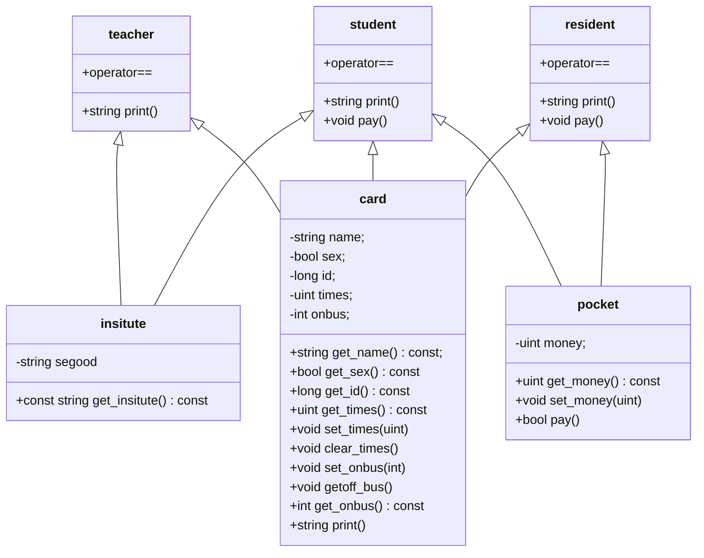

# 大作业：一卡通模拟系统
说是一卡通，实际上就是公交卡。所以我们可以称之为：  
	College ID Card and College Bus Simulation Program

## 程序构成

### maggie.hpp
我觉得我们的程序是必须要做到独立自主，要在复杂多变的电脑环境中保持自己的独立性。所以，我使用了 C++ 里面命名空间的知识，专门为这个程序规定了 maggie 命名空间。
这个命名空间里面引用了 std 命名空间，为了从 C++ 优秀的通用库中取其精华，弃其糟粕。另外，我还规定了一些公用的变量，体现出程序的灵活性。
(这是什么奇怪的政治新闻语言)

### card.hpp
先分析一下哈，我们要为老师，学生，居民设计一卡通。除了共有信息，老师坐车不用花钱，居民有二十次免费乘车，而且不隶属于学院。好，学生这是第几次受伤了捏:-P
这里，我先实现了三个基本类：校园卡基本信息 `card` ，学院信息 `insitute`，还有卡里的钱包 `pocket` 。基于这三个类，我们可以实现老师 `teacher` ，学生 `student` 和居民 `resident` 了。这三个类是继承了 `card` 类，然后按需引用了 `insitute` 或/和 `pocket` 类了。
代码太多了，Typora 支持 mermaid 画画工具，请看由他带来的图解。
注意，`card` 里面有个 `print()` 纯虚函数，`pocket` 里面有个 `pay()` 纯虚函数。



### card_process.hpp
注意：因为仅仅是为了方便使用，我直接让其全部共有。
这里我建立了三个表，分别存了老师卡，学生卡和家属卡的信息。
然后是几个函数，分别是新建一张一卡通，管理这些一卡通，存储一卡通和打印一卡通信息。
管理功能包括充值、查询余额、询已使用次数、注销卡。
存储的信息是纯文本信息，每个类里面的 `print()` 函数是用来输出存储的信息的。
```C++
struct card_process
{
    vector<teacher> teachers;
    vector<student> students;
    vector<resident> residents;
    void add_cards();
    void card_management();
    void read_cardlist();
    void save_cardlist();
    void print_cardlist();
};
```

### bus.hpp
这个是公交车类，里面存了驾驶人信息，车辆型号，车辆编号，发车时间，上车人数，上车人员。
关于公交车型号，由于本题目只有两个：大车五十人，小车三十人。我就直接使用了布尔型，为真是五十人，为假是三十人。
```C++
class bus
{
private:
    string driver;      
    uint id; 
    bool model;
    uint onboard_id;
    uint offtime;
    uint onboard_count;

public:
	uint get_max() const { return model ? 50 : 30; }
	// Lots of functions, omit them here.
	...
}
```
还有上车人员，是**一个**整型常量，存的卡号。这里先剧透一些关于模拟运行的信息。发车时电脑会随便输入个乘员人数，然后随便从一卡通名单里面摇一个人上车，只有一个人被摇中嘛。

### bus_process.hpp
注意：因为仅仅是为了方便使用，我直接让其全部共有。
首先是两个表，一个是正在运行的车，一个是在车站没出发的车。毕竟模拟嘛，这点仪式感还是得有的;-)
然后是读写公交车信息，添加公交车，列出所有公交车。(感觉永远就是这几套)
读写公交车过程可类比一卡通信息的读写过程。
```C++
struct bus_process
{
    vector<bus> station;
    vector<bus> ongoing;
    void add_bus();
    void list_bus(vector<bus> &);
    void bus_management();
    void read_station();
    void save_station();
};
```

## 运行流程

### 先说一句
如何管理一卡通和公交车信息的过程，我上面应该说得明白了，这里就不说了。实在不行看源代码吧。
顺便说一下  C++ 11 循环，现在我们可以使用 `for (auto &i : <vector_of_something>)`来循环了。什么类型迭代器啥的给老子去死吧，auto 一写，让编译器自己猜去吧。而且三个分号的复杂也没了。
(这就是菜鸡小白第一次知道这玩意时候的山口山)

### 运行模拟方式
先说一句，这段代码在 main.cpp 里面。
1. 先遍历一遍所有公交车，给所有的车辆随便编个发车时间。
2. 在发车时间内，分别循环遍历所有在车站的车和在运行的车辆。如果到时间了发车了，就将其从车站数组里面移到运行中车的数组。如果运行时间到了，就将其从运行中车的数组里面移回车站数组。
3. 发车的时候，首先随便编个车辆有多少人。然后很不走心地从一卡通名单里面摇一个人最尊贵的乘客上车。上车的时候，车辆有空座，上车的人没有坐在另一辆车上，而且能支付得起车票钱。如果三类人都没摇上人，就没摇上吧。
4. 回到车站的时候，把人清空，再把最尊贵的乘客请下车。

### 如何更加省心地随便编个数
1. 先引入 C++ 11 标准的全新标准库 `random`。
2. 先找个能生成随机种子的随机数引擎，我用的是 `random_device`，在 Linux 上相当于读取 `/dev/urandom` 产生的随机数。我们不使用该引擎生成随机数，因为根据原理，在生成随机数的时候，会产生大量的输入输出中断，一定程度上影响性能，而且会下降 `/dev/urandom` 生成随机数的质量。
3. 然后利用上述引擎，生成我们要用的引擎 `default_random_engine`。
4. 我们利用该随机数引擎，生成随机数。由于我们这里使用无符号的随机数，遵循均匀分布，我们使用 `uniform_int_distribution<uint>` 类来生成之。
顺便说一句，`random`库还能支持你在概率论课程上学到的所有玩意，比如万恶的正态分布，泊松分布啥的。

## 运行片断
TODO

## 实验心得
TODO

## 三个文件里面的音乐知识
TODO

