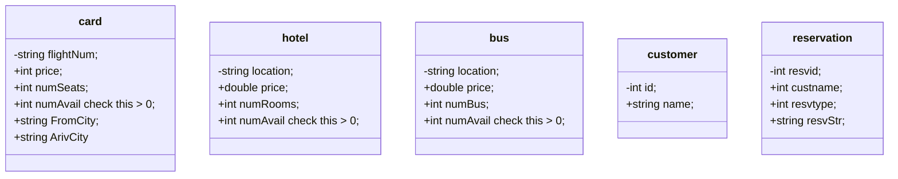

# 大作业：旅行预订系统

我通过这个作业，学了 [vala](https://vala.dev/) 语言和 [SQLite 的 C/C++ 绑定]([SQLite Home Page](https://www.sqlite.org/index.html))。用 MySQL / PostgreSQL 也不是不可以，但我觉得对于这个作业来说，没必要搞个服务器进程+客户端操控吧:-P

SQLite 将数据库存在一个文件里，使用的时候，调用 SQLite 库相应的函数，来对这个文件进行

## 基本功能

1. 通过 SQLite 提供的接口操控数据库。

2. 预定，查询航班，旅店和大巴车。

3. 查看各地点的可行性。

4. 查看，修改用户数据。

## 数据结构

