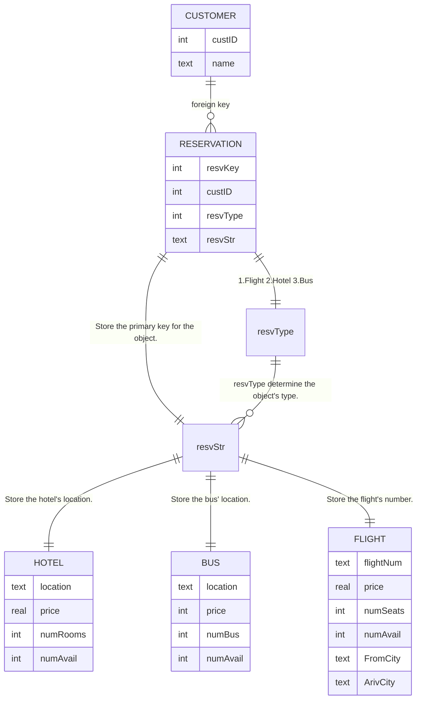

# 大作业：旅行预订系统

我通过这个作业，学了 [Vala](https://vala.dev/) 语言和 [SQLite 的 C/C++ 绑定]([SQLite Home Page](https://www.sqlite.org/index.html))。用 MySQL / PostgreSQL 也不是不可以，但我觉得对于这个作业来说，没必要搞个服务器进程+客户端操控吧（我无法接受电脑一直运行 mariadb）。

SQLite 将数据库存在一个文件里，使用的时候，调用 SQLite 库相应的函数，来对这个文件数据库进行基本操作。ODBC 和 JBDC 应该是有，不过 Vala 貌似没人写头文件:-P

(Vala 官方给的示例是对 SQLite 和 PostgreSQL 直接操作)

~~Vala 简介是付费内容~~

## 基本功能

1. 通过 SQLite 提供的接口操控数据库。

2. 预定，查询航班，旅店和大巴车。

3. 查看各地点的可行性。

4. 查看，修改用户数据。

## 数据库结构

mermaid 的 E-R 图不支持圆圈，有点难受，所以以下的图不太能展示整个数据库结构的准确状况。



下面是我敲进程序的建表语句：

```vala
private const string CREATE_FLIGHT_TABLE_QUERY = """
    CREATE TABLE IF NOT EXISTS FLIGHT (
        flightNum   TEXT    PRIMARY KEY NOT NULL UNIQUE,
        price       REAL    NOT NULL,
        numSeats    INT     NOT NULL,
        numAvail    INT     NOT NULL    CHECK (numAvail >= 0),
        FromCity    TEXT    NOT NULL,
        ArivCity    TEXT    NOT NULL
    );
""";

private const string CREATE_HOTEL_TABLE_QUERY = """
    CREATE TABLE IF NOT EXISTS HOTEL (
        location    TEXT    PRIMARY KEY NOT NULL,
        price       REAL    NOT NULL,
        numRooms    INT     NOT NULL,
        numAvail    INT     NOT NULL    CHECK (numAvail >= 0)
    );
""";

private const string CREATE_BUS_TABLE_QUERY = """
    CREATE TABLE IF NOT EXISTS BUS(
        location    TEXT    PRIMARY KEY NOT NULL,
        price       INT     NOT NULL,
        numBus      INT     NOT NULL,
        numAvail    INT     NOT NULL    CHECK (numAvail >= 0)
    );
""";

private const string CREATE_CUSTOMER_TABLE_QUERY = """
    CREATE TABLE IF NOT EXISTS CUSTOMER(
        custID      INT     PRIMARY KEY NOT NULL,
        custName    TEXT    NOT NULL
    );
""";

private const string CREATE_RESERVATION_TABLE_QUERY = """
    CREATE TABLE IF NOT EXISTS RESERVATION(
        resvKey     INT     PRIMARY KEY NOT NULL,
        custName    INT     NOT NULL,
        resvType    INT     NOT NULL,
        resvStr     TEXT    NOT NULL,
        FOREIGN KEY(custName) REFERENCES CUSTOMER(custID),
        CHECK (resvType >= 1 and resvType <= 3)
    );
""";
```

如代码所示，我添加了 numAvail < numSeats 的约束，和一个预约表里面约束用户信息的外键约束。其他的很多约束，我考虑过使用触发器来实现，但经过我程序设计，我发现多数代码只需在程序里面写好，由程序规定好即可，不必由数据库来实现。

## C 语言的 SQLite 函数概览

为啥是 C 语言的，因为 Vala 的 SQLite 支持是把 C 语言支持的头文件给“照搬”了。

~~Vala 中的 SQLite 函数是付费内容~~

### 基础函数

通过这个方式来创建一个 SQLite 结构体：

```C
sqlite *db;
```

通过这个方式，打开一个数据库：

```C
int sqlite3_open(
    const char *filename,    /* 文件所在的路径 */
    sqlite3 **ppDb           /* 对应的 SQLite 结构体 */
);
```

通过这个方式，来在这个数据库上执行 SQL 语句：

```C
int sqlite3_exec(
    sqlite3*,            /* 要执行的数据库 */
    const char *sql,     /* 执行语句 */
    sqlite_callback,     /* 回调 */
    void *data,          /* 回调参数 */
    char **errmsg        /* 接受错误信息的字符串 */
);
```

使用完数据库后，通过这个函数释放数据库。

```C
int sqlite3_close( sqlite3* /* 你需要关闭的数据库 */ );
```

### 函数返回值

SQLite 里面的函数在执行的时候，都会有一个返回值。在 C 语言头文件里面，是一堆 define 。以下是 sqlite3.h 文件里面的东西。

```c
/*
** sqlite3.h, version 3.40.0, line 433-476.
**
** CAPI3REF: Result Codes
** KEYWORDS: {result code definitions}
** 返回值 要点：返回值和定义
**
** Many SQLite functions return an integer result code from the set shown
** here in order to indicate success or failure.
** 许多 SQLite 函数的返回值是下面定义的整型，以反映成功/失败状态。
**
** New error codes may be added in future versions of SQLite.
** 新的错误码将会在未来版本加入。
**
** See also: [extended result code definitions]
** 还有扩充版返回值定义:-P
*/
#define SQLITE_OK           0   /* Successful result */
/* beginning-of-error-codes */
/* 除了0之外全是出错 */
#define SQLITE_ERROR        1   /* Generic error */
#define SQLITE_INTERNAL     2   /* Internal logic error in SQLite */
#define SQLITE_PERM         3   /* Access permission denied */
#define SQLITE_ABORT        4   /* Callback routine requested an abort */
#define SQLITE_BUSY         5   /* The database file is locked */
#define SQLITE_LOCKED       6   /* A table in the database is locked */
#define SQLITE_NOMEM        7   /* A malloc() failed */
#define SQLITE_READONLY     8   /* Attempt to write a readonly database */
#define SQLITE_INTERRUPT    9   /* Operation terminated by sqlite3_interrupt()*/
#define SQLITE_IOERR       10   /* Some kind of disk I/O error occurred */
#define SQLITE_CORRUPT     11   /* The database disk image is malformed */
#define SQLITE_NOTFOUND    12   /* Unknown opcode in sqlite3_file_control() */
#define SQLITE_FULL        13   /* Insertion failed because database is full */
#define SQLITE_CANTOPEN    14   /* Unable to open the database file */
#define SQLITE_PROTOCOL    15   /* Database lock protocol error */
#define SQLITE_EMPTY       16   /* Internal use only */
#define SQLITE_SCHEMA      17   /* The database schema changed */
#define SQLITE_TOOBIG      18   /* String or BLOB exceeds size limit */
#define SQLITE_CONSTRAINT  19   /* Abort due to constraint violation */
#define SQLITE_MISMATCH    20   /* Data type mismatch */
#define SQLITE_MISUSE      21   /* Library used incorrectly */
#define SQLITE_NOLFS       22   /* Uses OS features not supported on host */
#define SQLITE_AUTH        23   /* Authorization denied */
#define SQLITE_FORMAT      24   /* Not used */
#define SQLITE_RANGE       25   /* 2nd parameter to sqlite3_bind out of range */
#define SQLITE_NOTADB      26   /* File opened that is not a database file */
#define SQLITE_NOTICE      27   /* Notifications from sqlite3_log() */
#define SQLITE_WARNING     28   /* Warnings from sqlite3_log() */
#define SQLITE_ROW         100  /* sqlite3_step() has another row ready */
#define SQLITE_DONE        101  /* sqlite3_step() has finished executing */
/* end-of-error-codes */
```

看看 SQLite 的头文件吧，很详细的。

## 使用 SQLite 声明

使用 SQLite 声明来执行 SQL 语句，比直接调用 exec 更高效。

首先，你需要写好一个 SQL 语句，碰到待定的地方可以用问号，或者 `$xxx` 等形式表示。以下是我程序里面的示例：

```vala
private const string ADD_HOTEL_DATA = """
    INSERT INTO HOTEL (location, price, numRooms, numAvail)
    VALUES ($LOCATION, $PRICE, $NUMBEROFROOMS, $NUMBEROFAVALIABLE);
""";
```

然后使用这个函数，准备声明：

```C
sqlite3_stmt *stmt = NULL; /* 先初始化一个空的 */
int sqlite3_prepare_v2(
  sqlite3 *db,             /* 需要用到的数据库 */
  const char *zSql,        /* SQL 语句 */
  int nByte,               /* 字符串长度 */
  sqlite3_stmt **ppStmt,   /* OUT: 指向一个需要初始化的声明 */
  const char **pzTail      /* OUT: 貌似是说 SQL 声明的尾部，可以不管吧 */
);
```

然后，使用 `sqlite_bind`系列函数在声明上绑定变量，以下用 `sqlite3_bind_text` 举例：

```C
int sqlite3_bind_text(
    sqlite3_stmt*,        /* 需要用到的声明 */
    int,                  /* 在声明需要绑定位置的索引，从 1 开始计数 */
    const char*,          /* 需要绑定的字符串 */
    int,                  /* 字符串的长度 */
    void(*)(void*)        /* 某种析构函数，当绑定失败执行这个吧 */
);
```

还有 `sqlite3_bind_int`，`sqlite3_bind_double`之类，用法都差不多。

注意，你可以用这个函数寻找声明里面的索引：

```c
int sqlite3_bind_parameter_index(
    sqlite3_stmt*,         /* 需要用到的声明 */
    const char *zName      /* 需要寻找的绑定位置 */
);
```

如果没找到的话，就返回 0。

现在你可以执行绑定完变量的声明了。

```c
int sqlite3_step( sqlite3_stmt* /* 需要用到的声明 */ );
```

这个函数执行完，有三个状态：`SQLITE_DONE`，`SQLITE_ROW`和各种报错。接下来我们关注 ``SQLITE_ROW`，也就是返回一条行记录的状况，这个一般会出现在执行了 SELECT 的情况。

我们使用 `sqlite_column`系列函数取出这些东西，先输入使用到的声明，然后输入索引，返回值就是里面的数据。

```C
const void *sqlite3_column_blob(sqlite3_stmt*, int iCol);
double sqlite3_column_double(sqlite3_stmt*, int iCol);
int sqlite3_column_int(sqlite3_stmt*, int iCol);
sqlite3_int64 sqlite3_column_int64(sqlite3_stmt*, int iCol);
const unsigned char *sqlite3_column_text(sqlite3_stmt*, int iCol);
const void *sqlite3_column_text16(sqlite3_stmt*, int iCol);
sqlite3_value *sqlite3_column_value(sqlite3_stmt*, int iCol);
int sqlite3_column_bytes(sqlite3_stmt*, int iCol);
int sqlite3_column_bytes16(sqlite3_stmt*, int iCol);
int sqlite3_column_type(sqlite3_stmt*, int iCol);
```

清除绑定，使用如下函数：

```C
int sqlite3_reset(sqlite3_stmt *pStmt /* 需要用到的声明 */ );
```

删除声明，使用如下函数：

```C
int sqlite3_finalize(sqlite3_stmt *pStmt /* 需要删除的声明 */ );
```

## 程序构成

### database.vala

这里是数据库类，数据库本身和操控数据库的函数。

```vala
// 2022 SuperBart, released under SuperBart Public Domain Software License.
// Database project, database class. Use sqlite because using mysql is a waste.
// Mostly formulas I used are from sqlite C/C++ header, instead of obdc.

using Gee;
using Sqlite;

public class Travel_Management.Database : GLib.Object {

    const string NAME_OF_DB = "travel.db";

    private Sqlite.Database m_db;

    // 接下来的部分是预先规定好的语句
    private const string CREATE_FLIGHT_TABLE_QUERY;
    private const string CREATE_HOTEL_TABLE_QUERY;
    private const string CREATE_BUS_TABLE_QUERY;
    private const string CREATE_CUSTOMER_TABLE_QUERY;
    private const string CREATE_RESERVATION_TABLE_QUERY;

    private const string ADD_FLIGHT_DATA;
    private const string ADD_HOTEL_DATA;
    private const string ADD_BUS_DATA;
    private const string ADD_CUSTOMER_DATA;
    private const string ADD_RESERVATION_DATA;

    private const string UPDATE_FLIGHT_DATA;
    private const string UPDATE_HOTEL_DATA;
    private const string UPDATE_BUS_DATA;
    private const string UPDATE_CUSTOMER_DATA;

    // TODO: Should not use it!
    private const string UPDATE_RESERVATION_DATA;

    private const string DELETE_FLIGHT_DATA;
    private const string DELETE_HOTEL_DATA;
    private const string DELETE_BUS_DATA;
    private const string DELETE_CUSTOMER_DATA;
    private const string DELETE_RESERVATION_DATA;

    // 以下部分是 SQLite 声明部分
    private Sqlite.Statement add_flight;
    private Sqlite.Statement update_flight;
    private Sqlite.Statement delete_flight;

    private Sqlite.Statement add_hotel;
    private Sqlite.Statement update_hotel;
    private Sqlite.Statement delete_hotel;

    private Sqlite.Statement add_bus;
    private Sqlite.Statement update_bus;
    private Sqlite.Statement delete_bus;

    private Sqlite.Statement add_customer;
    private Sqlite.Statement update_customer;
    private Sqlite.Statement delete_customer;

    private Sqlite.Statement add_reservation;
    private Sqlite.Statement update_reservation;
    private Sqlite.Statement delete_reservation;

    // 以下是集成了异常抛出的 SQLite 函数
    private void open () throws DatabaseError
    private void exec (string exec) throws DatabaseError
    public Sqlite.Statement prepare (string sql) throws DatabaseError
    private void bind_text (Sqlite.Statement statement, string stmt, string text) throws DatabaseError
    private void bind_int (Sqlite.Statement statement, string stmt, int content) throws DatabaseError
    private void bind_double (Sqlite.Statement statement, string stmt, double content) throws DatabaseError
    // Not support SQLITE_STEP
    private void step (Sqlite.Statement statement) throws DatabaseError

    // 新建数据库的函数
    public void createDatabase () {
        try {
            open ();
            exec (CREATE_FLIGHT_TABLE_QUERY);
            exec (CREATE_HOTEL_TABLE_QUERY);
            exec (CREATE_BUS_TABLE_QUERY);
            exec (CREATE_CUSTOMER_TABLE_QUERY);
            exec (CREATE_RESERVATION_TABLE_QUERY);
        } catch (DatabaseError e) {
            stderr.printf ("%s\n", e.message);
        }
    }

    // 准备声明
    private void prepare_statements ()

    // 数据库初始化函数
    public Database ()

    // For Flight Data
    public bool removeFlightData (string id)
    public bool addFlightData (Travel_Management.Flight toAppend)
    public bool changeFlightData (Travel_Management.Flight toChange)

    //For Bus Data
    public bool removeBusData (string location)
    public bool addBusData (Travel_Management.Bus toAppend)
    public bool changeBusData (Travel_Management.Bus toChange)

    // For Hotel Data
    public bool removeHotelData (string location)
    public bool addHotelData (Travel_Management.Hotel toAppend)
    public bool changeHotelData (Travel_Management.Hotel toChange)

    // For Customer Data
    public bool removeCustomerData (int id)
    public bool addCustomerData (Travel_Management.Customer toAppend)
    public bool changeCustomerData (Travel_Management.Customer toChange)

    // For Reservation Data
    public bool removeReservationData (int key) 
    public bool addReservationData (Travel_Management.Reservation toAppend)
    public bool changeReservationData (Travel_Management.Reservation toChange)

    // 搜索函数
    public Array<Flight> search_flight (string id = "") throws DatabaseError
    public Array<Hotel> search_hotel (string location = "") throws DatabaseError
    public Array<Bus> search_bus (string location = "") throws DatabaseError
    public Array<Customer> search_customer (int? custID = null) throws DatabaseError
    public Array<Reservation> search_reservation (int resvKey = 0) throws DatabaseError

    // 查询各个城市之间的通行状况
    public HashMap<string, HashSet<string>> ? avaliable () {
        try {
            var Graph = new HashMap<string, HashSet<string>> ();
            Sqlite.Statement get_flight = this.prepare ("SELECT FromCity,ArivCity FROM FLIGHT;");
            while (get_flight.step () == Sqlite.ROW) {
                string from = get_flight.column_text (0);
                string to = get_flight.column_text (1);
                if (!Graph.has_key (from)) {
                    Graph[from] = new HashSet<string> ();
                }
                Graph[from].add (to);
            }
            return Graph;
        } catch (DatabaseError e) {
            stdout.printf (e.message);
            return null;
        }
    }
}
```

如您所见，这个类集成了数据库很基本的插入，查询和删除，都是经过 SQLite 声明实现的。当然，如果出现一些很特殊的状况，我们也支持通过 exec 操作。

### management.vala

面向用户的界面，主要是针对后台用户。目前实现了以下功能：

* 插入数据

* 修改数据

* 删除数据

* 查询数据

* 自动生成测试数据

* 展示各个城市之间连通状况

* 查询两个城市之间是否可达

### 其他部分

* database-error.vala ，是错误类的定义。

* classes.vala ，是程序中使用的数据结构定义。

* main.vala ，程序入口。

### 两地连通性测试

首先维护一个各个城市之间的邻接表，类似这样：

```
[superbart@superbart-laptop src]$ ./travel_management
Statements prepared.
Statements prepared.

--------------- Administer --------------
1.Insert   2.Delete   3.Query   4.Update   5.Generate   6.Display   7.Eval   0.Quit
Your Choice: 6
Tianjin: Hohhot,Shanghai,Shenzhen,
Urumqi: Wuhan,Tianjin,Beijing,
Hohhot: Urumqi,
Wuhan: Hohhot,Tianjin,
Xi'an: Tianjin,Shanghai,Beijing,
Beijing: Lonely city.
Shanghai: Beijing,
Shenzhen: Shanghai,
```

当我们需要查询两个城市之间的连通性时候，维护一个可到达城市的 Set 集合。我们从最开始城市开始，对于每个集合里面的城市，把这个城市所能到达的城市都给加入到 Set 集合。如果 Set 集合里面有了这个城市，就表明能到达。如果没有新元素插入，而且集合里面还是没有目的地，那就说明不可达。

```
--------------- Administer --------------
1.Insert   2.Delete   3.Query   4.Update   5.Generate   6.Display   7.Eval   0.Quit
Your Choice: 7
0 Tianjin
1 Urumqi
2 Hohhot
3 Wuhan
4 Xi'an
5 Beijing
6 Shanghai
7 Shenzhen
Choice a departure: 6
Choice a destination: 4
Unable to reach!
```

# 程序执行片段

```
[superbart@superbart-laptop src]$ ./travel_management
Statements prepared.
Statements prepared.

--------------- Administer --------------
1.Insert   2.Delete   3.Query   4.Update   5.Generate   6.Display   7.Eval   0.Quit
Your Choice: 1

--------------- INSERT DATA --------------
1.Flight   2.Hotel   3.Bus   4.Customer  5.Reservation
Your Choice: 5

--------------- CUSTOMER LIST --------------
NUM     custID  NAME
1       20      SuperBart
Enter custID(int): 20
Enter resvKey(int): 1
Enter resvType(int), 1.Flight 2.Hotel 3.Bus: 1
NUM     FLIGHTNUM       PRICE   NUMSEAT NUMAVA  FROM    ARRI
1       A-000001        140.00  40      40      Xi'an   Beijing
2       A-000002        140.00  30      30      Urumqi  Tianjin
3       A-000003        120.00  45      45      Urumqi  Beijing
4       A-000004        100.00  45      45      Tianjin Hohhot
5       A-000005        160.00  55      55      Xi'an   Shanghai
6       A-000006        180.00  30      30      Wuhan   Tianjin
7       A-000007        120.00  30      30      Hohhot  Urumqi
8       A-000008        120.00  55      55      Wuhan   Hohhot
9       A-000009        220.00  60      60      Tianjin Shenzhen
10      A-0000010       140.00  35      35      Shanghai        Beijing
11      A-0000011       160.00  55      55      Shenzhen        Shanghai
12      A-0000012       140.00  40      40      Urumqi  Wuhan
13      A-0000013       100.00  60      60      Xi'an   Tianjin
14      A-0000014       200.00  60      60      Urumqi  Tianjin
15      A-0000015       140.00  50      50      Tianjin Shanghai
16      A-0000016       120.00  55      55      Urumqi  Tianjin
Enter the flight number: A-000001

--------------- Administer --------------
1.Insert   2.Delete   3.Query   4.Update   5.Generate   6.Display   7.Eval   0.Quit
Your Choice: 3

--------------- QUERY DATA --------------
1.Flight   2.Hotel   3.Bus   4.Customer  5.Reservation
Your Choice: 5
NUM     CUSTNAME        RESKEY  RESTYPE RESSTR
1       SuperBart       1       1       A-000001

--------------- Administer --------------
1.Insert   2.Delete   3.Query   4.Update   5.Generate   6.Display   7.Eval   0.Quit
Your Choice: 3

--------------- QUERY DATA --------------
1.Flight   2.Hotel   3.Bus   4.Customer  5.Reservation
Your Choice: 1
NUM     FLIGHTNUM       PRICE   NUMSEAT NUMAVA  FROM    ARRI
1       A-000001        140.00  40      39      Xi'an   Beijing
2       A-000002        140.00  30      30      Urumqi  Tianjin
3       A-000003        120.00  45      45      Urumqi  Beijing
4       A-000004        100.00  45      45      Tianjin Hohhot
5       A-000005        160.00  55      55      Xi'an   Shanghai
6       A-000006        180.00  30      30      Wuhan   Tianjin
7       A-000007        120.00  30      30      Hohhot  Urumqi
8       A-000008        120.00  55      55      Wuhan   Hohhot
9       A-000009        220.00  60      60      Tianjin Shenzhen
10      A-0000010       140.00  35      35      Shanghai        Beijing
11      A-0000011       160.00  55      55      Shenzhen        Shanghai
12      A-0000012       140.00  40      40      Urumqi  Wuhan
13      A-0000013       100.00  60      60      Xi'an   Tianjin
14      A-0000014       200.00  60      60      Urumqi  Tianjin
15      A-0000015       140.00  50      50      Tianjin Shanghai
16      A-0000016       120.00  55      55      Urumqi  Tianjin

```

## 实验总结

通过这次大作业，我学会了 SQLite 如何在程序里面绑定，也就是如何在程序嵌入数据库。这是一个比较底层的使用数据库方式。

## 程序编译方式(Windows)

1. 安装 msys2 ，然后安装以下包：`mingw-w64-x86_64-gcc``mingw-w64-x86_64-vala``mingw-w64-x86_64-readline``mingw-w64-x86_64-libgee```mingw-w64-x86_64-sqlite3`。

2. 设置好环境变量。

3. 使用这个命令编译
   
   ```powershell
    valac --pkg readline --pkg glib-2.0 --pkg gobject-2.0 --pkg sqlite3 --pkg gee-0.8 *.vala
   ```
